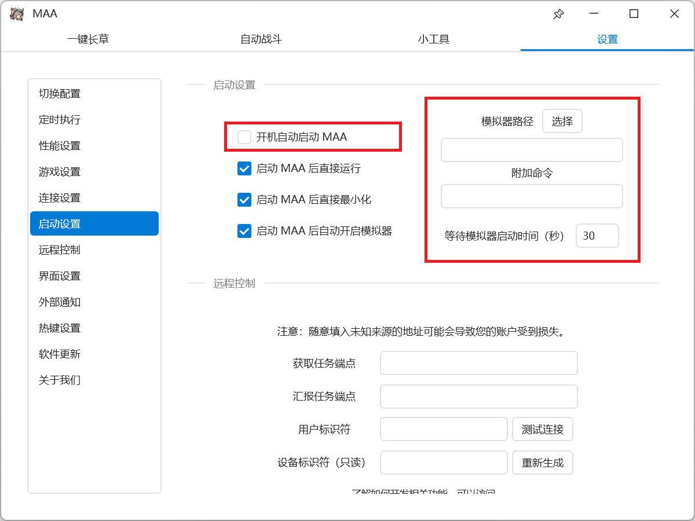
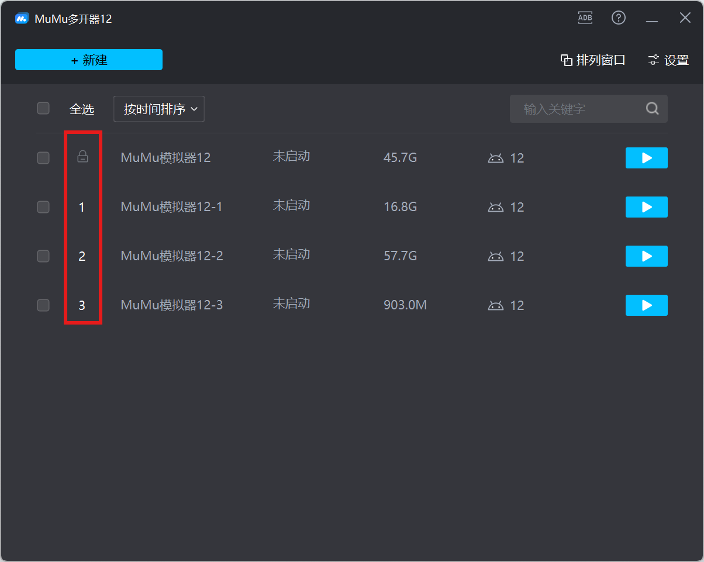
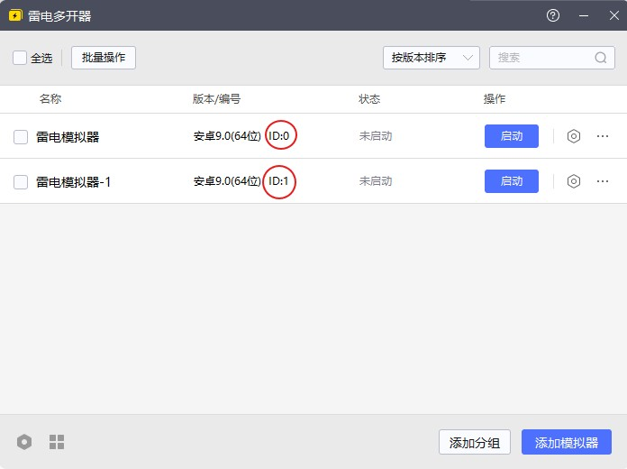
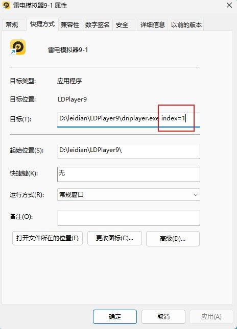

# 多开指南

::: warning 观前须知
模拟器多开可能会造成ADB端口混乱而导致一系列后续问题，故不建议零基础用户直接使用多开功能。

此外，单个 MAA 脚本实例一般可以承担不大于 4 个用户的代理任务。持有账号数量较少时建议优先选择单开。

如果确定要使用，请认真阅读本文档后再进行提问。
:::

## MAA设置

在使用多开模拟器前，需要对 MAA 的 **启动设置** 进行正确的设置。

### 模拟器路径

建议您在 **模拟器路径** 中正确填写模拟器 exe 程序所在位置，而不是快捷方式的位置。

可以通过在快捷方式图标 **右键 > 打开文件所在位置** 找到模拟器 exe 程序所在位置。

### 附加命令

由于多开模拟器共用同一个 exe 启动程序，为了区分，需要填写附加命令，以下给出主流模拟器的附加命令与通用的附加命令查找方法。

#### MuMu模拟器

- **格式**：`-v {ID}`

- **参数**：

    - `{ID}`：模拟器实例编号（纯数字），可在 **MuMu多开器12** 中查看。

- **样例**：`-v 0`、`-v 1`、`-v 2`

#### 雷电模拟器

- **格式**：`index={ID}`

- **参数**：

    - `{ID}`：模拟器实例编号（纯数字），可在 **雷电多开器** 的 **版本/编号** 一栏中查看。

- **样例**：`index=0`、`index=1`、`index=2`

#### 蓝叠国际版（BlueStacks）

- **格式**：`--instance {VERSION}_{ID}`

- **参数**：

    - `{VERSION}`：模拟器版本，如：`Pie64`、`Nougat32`。
    - `{ID}`：模拟器实例编号（纯数字），默认的 0 号实例无需添加该参数，格式变为`--instance {VERSION}`

- **样例**：`--instance Pie64`、`--instance Pie64_1`、`--instance Nougat32_2`

#### 通用的附加命令查找方法

多数模拟器的**多开管理器**提供 **创建桌面快捷方式** 的功能，该快捷方式中通常包含 **附加命令**

操作步骤如下：

1. 打开模拟器 **多开管理器**。
2. 找到对应的实例，点击 **创建快捷方式到桌面** *具体位置各家模拟器不同且不一定都有*。
3. 在桌面找到该快捷方式， **右键 > 属性**。
4. 在 **目标** 一栏中查看 `xxxplayer.exe` 后面附带的参数，即为该实例的启动参数。

::: tip 提醒
- 启动默认的第一个模拟器时，通常无需添加任何参数；
- 未提及的模拟器参考 **通用的附加命令查找方法**，若仍无法找到，可在 Issues 中咨询。
:::

### 等待模拟器启动时间（秒）

打开模拟器，看看从启动到进入模拟器的时间是多少秒，在此基础上加 10s 左右的容错时间后填入即可。

## AUTO_MAA 设置

- 对于需要多开并行运行的任务，需要为每个任务分配一个独立的 **MAA 脚本**。您可以通过复制完整的 MAA 脚本文件夹来创建多个 **MAA 脚本**。
- 对于每个 **MAA 脚本**，程序需要有一个对应的 **脚本实例** 进行管理。您可以通过 **脚本实例** 主页面的 **添加** 按钮添加新的 MAA 脚本管理子页面，然后通过 **选择文件夹** 绑定 **MAA 脚本**，并完成脚本相应配置。
- 为了能让 **脚本实例** 同时运行，您需要为每个 **脚本实例** 设置相同的 **定时**。您可以在 **调度队列** 主页面为每个 **脚本实例** 添加一个对应的 **调度队列**，每个 **调度队列** 的 **状态** 应为 `启用`，**定时设置** 应相同，**任务队列** 的首项应为对应的 **脚本实例**。

完成以上配置后，AUTO_MAA 将在您所选的时刻打开多个 **调度台** 同时运行相应任务。