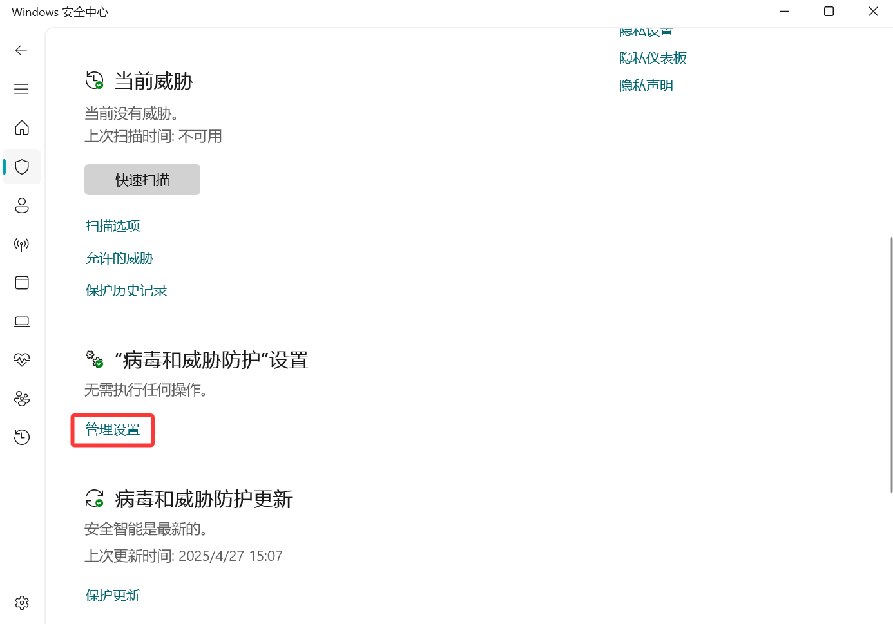
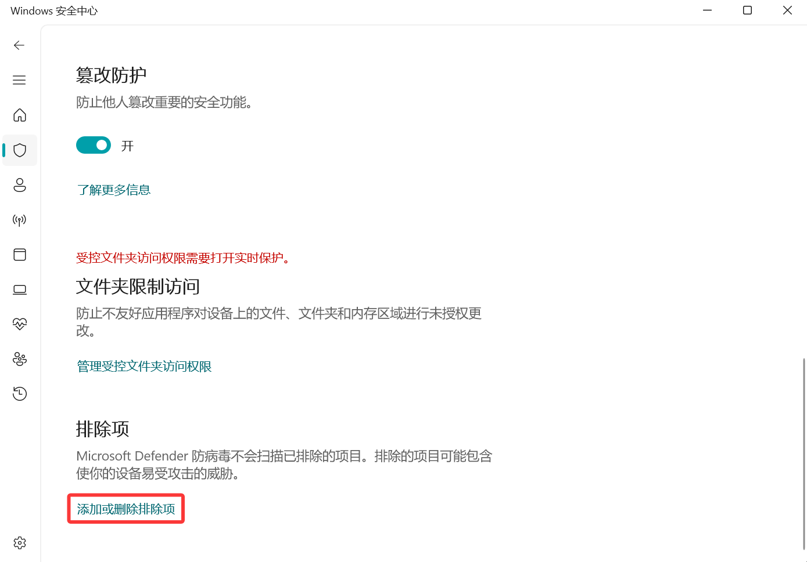
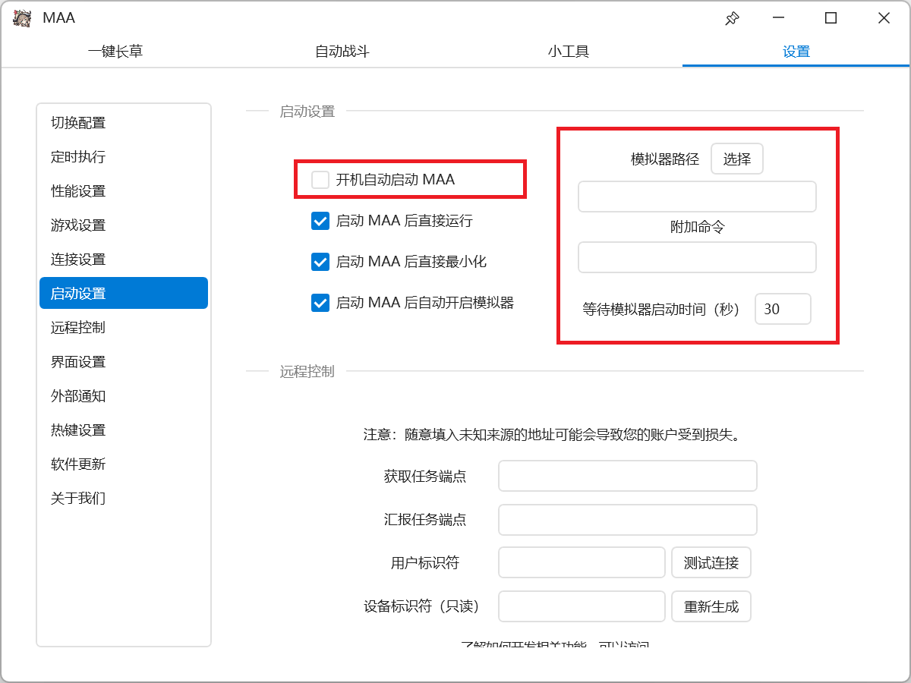

# 新手上路

## 前置信息

### 什么是 AUTO_MAA？

AUTO_MAA 是明日方舟第三方软件 **MAA** 的多账号管理与自动化软件，实现存储多个明日方舟账号数据，并结合 MAA 的能力完成多账号代理。

> 我们不实现具体功能，我们只是 MAA 的调度器。

### 什么是 MAA？

MAA 是一个明日方舟第三方软件，能够轻松完成明日方舟日常代理、肉鸽存钱等重复性无趣工作。

**详情信息请查阅**：

<Box :items="[
{ name: 'MAA 官网', link: 'https://maa.plus/', image: 'https://maa.plus/favicon.ico', },
{ name: 'MAA GitHub', link: 'https://github.com/MaaAssistantArknights/MaaAssistantArknights', image: { light: '/resource/github.svg', dark: '/resource/github-dark.svg', }, },]"/>

## 使用方法

### 安装 MAA

1. 前往 <Pill name="MAA 官网" image="https://maa.plus/favicon.ico" link="https://maa.plus"/>、<Pill name="MAA 仓库" :image="{ light: '/resource/github.svg', dark: '/resource/github-dark.svg', }" link="https://github.com/MaaAssistantArknights/MaaAssistantArknights/releases/latest"/> 或 <Pill name="Mirror 酱" image="https://mirrorchyan.com/favicon.ico" link="https://mirrorchyan.com/zh/projects?rid=MAA&scouce=AUTO_MAA-Web"/> 下载软件压缩包。
2. 将 MAA 压缩包解压至任意文件夹。

### 安装 AUTO_MAA

1. 前往 [下载页](/download/auto-maa) 获取最新版本安装包。
2. 解压 AUTO_MAA 压缩包并双击运行 `AUTO_MAA-Setup.exe`。
3. 按照安装指引将 AUTO_MAA 安装至任意文件夹。

### 为软件添加信任

运行软件前，请将 `MAA 安装目录`、`AUTO_MAA 安装目录`、`%TEMP%\AUTO_MAA` 添加入 Windows Defender 排除项以及防病毒软件的信任区或开发者目录，避免被误杀。以下展示 **添加 Windows Defender 排除项** 方法：

快速链接：<Pill name="Windows 安全中心" link="ms-settings:windowsdefender"/>

1. 若已安装其它杀毒软件，请先打开 **定期扫描**。

2. **“病毒和威胁防护”设置 > 管理设置**

3. **排除项 > 添加或删除排除项**

4. **添加排除项 > 选中对应目录**

5. 若已安装其它杀毒软件，再次关闭 **定期扫描**。

*这总不需要示意图了吧*

::: warning 注意
即使已经安装其它杀毒软件（如：**火绒**、**360极速版**），**Windows Defender** 防病毒功能仍可能会不定时开启，这可能导致您的 `MAA.exe` 或 `AUTO_MAA.exe` 突然消失。因此，您必须确保以上目录被 **Windows Defender** 排除。
:::

### 启动 AUTO_MAA

1. 双击 `AUTO_MAA.exe` 启动软件。
2. 设置 **管理密钥**。

::: warning 注意
- **管理密钥是解密用户密码的唯一凭证**，与用户数据绑定，用于加密 **用户密码** 这类高保密信息。
  - 若 `data/key/` 目录下的文件损坏，解密功能将无法正常进行。
- **项目组无法找回您的管理密钥或修复 `data/key/` 目录下的文件**。
  - 若遗失密钥，建议使用 `重置管理密钥` 功能，该操作会清除所有用户密码信息。
:::

### 设置脚本实例

1. 打开 `MAA.exe`，在 **设置 > 切换配置** 中，确保当前配置为 **Default**。

2. 关闭 **MAA**，检查 `MAA.exe`，确保其无需以管理员身份运行。即确保 **MAA.exe > 右键 > 属性 > 兼容性 > 设置 > 以管理员身份运行此程序** 处于 **未勾选** 状态。

3. 进入 **脚本管理**，单击 **+** 并选择 **MAA** 以添加脚本实例管理页面。

4. 在 **MAA 目录** 中单击 **选择文件夹**，打开 MAA 软件所在目录。

5. 在 **MAA 全局配置** 中单击 **设置**，在打开的 MAA 页面中进行全局设置。您可以参照 [MAA 官方文档](https://maa.plus/docs/zh-cn/manual/) 进行设置。

6. 参照 [多开指南 > MAA 设置](/docs/multi-instance) 完成 **MAA** 的 **启动设置**，并手动取消勾选 **开机自启动MAA**。

7. 完成配置后，关闭 **MAA**。AUTO_MAA 成功保存您的配置后，将在右上角弹出 **任务结束** 消息。

### 设置用户配置

1. 在 **下属用户**选项卡中，单击 **+** 以添加一个用户。

2. 按照设置卡相关提示填写用户信息。

::: info 注意
开启 **自定义基建** 后需要 **选择配置文件**；**详细** 配置模式下开启 **剿灭任务**、**日常任务** 后需要 **设置具体配置**。
:::
::: tip 提示

由于 MAA 在 **B服账号切换** 功能中使用的 OCR（文字识别）技术准确率有限，我们建议如下填写方式以提高识别和切换成功率：

### 通用建议

- MAA 的账号切换功能只需**成功识别一个唯一片段**即可完成切换。
- 请填写**仅该账号独有的部分片段**，避免与其他账号重复。
- 建议在 MAA 中测试填写片段能否正常切换账号，确认无误后再填写至 AUTO_MAA。
- 若同区服仅有一个账号，也可将 `账号ID` 留空。

#### 官服

- 官服账号ID为手机号，通常只需填写**后四位数字**即可，无需填写完整手机号。~~（你也不想无意中泄露自己的手机号吧~）~~ 
- 示例：
  - 账号1：`133XXXX1234`
  - 账号2：`133XXXX5678`
  - 若要切换账号1，可填写 `2`、`4`、`12`、`34`、`123`、`234`、`1234` 等仅账号1拥有的片段。

#### B服

- B服账号为 B站昵称，可能包含**中文、英文、数字、特殊符号、日文**等复杂字符，OCR 模型识别准确率偏低。因此，**不建议填写完整昵称**，建议填写 **不易识别错误的、唯一片段**，避免：
  - 生僻字（如：`黍`，可能被识别为其他文字）
  - 下划线 `_`（常被识别错误或漏识）
- 示例：
  - 账号1：`DLmaster_361` → 可填写 `master`、`361`
  - 账号2：`黍的XX_1234` → 可填写 `1234`、`的`、`XX`，**不建议填写“黍”或下划线**

:::

### 设置调度队列

1. 进入 **调度队列**，单击 **+** 以添加一个调度队列。

2. 在 **任务队列 > 任务实例 1** 中选择之前添加的脚本实例。

### 设置全局配置

详见软件 **设置** 选项卡相关描述，或参考 **进阶功能、FAQ 页面** 相关说明。

### 运行自动代理

- **直接运行**：在 **调度中心** 选择任务与模式，单击 **开始任务** 开始代理。

- **定时运行**：调度队列 **状态** 设为 **开启**，在 **定时选项卡** 设置运行时间。保持软件运行，软件将在设定的时间自动执行任务。

- **多开运行**：**主调度台** 运行任务时，可以通过单击 **添加任务**，在新调度台开启新任务。定时启动多开任务，参见 [多开指南](/docs/multi-instance)。

