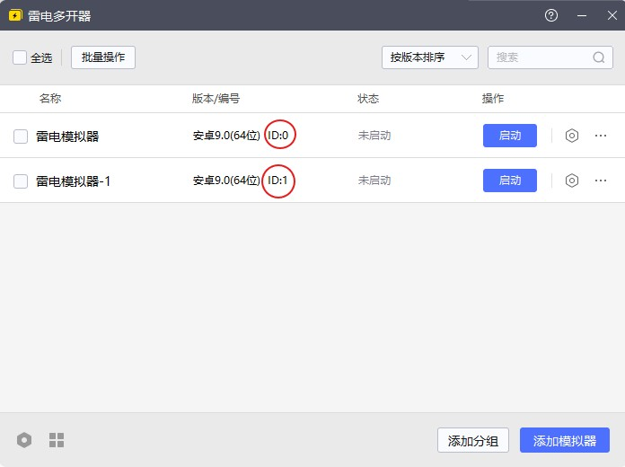
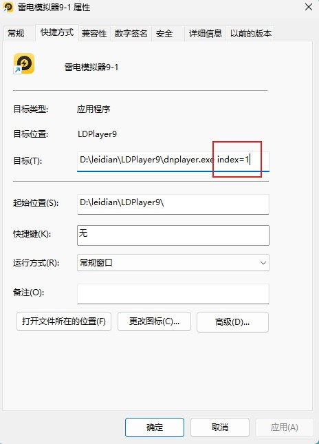

# 模拟器多开指南

:::warning
模拟器多开可能会造成ADB端口混乱而导致一系列后续问题，故不建议零基础用户直接使用多开。

如果确定要使用，请认真阅读本文档后再进行提问。
:::

多数安卓模拟器支持通过在启动命令中添加参数来实现多开功能。以下以 **雷电模拟器** 和 **蓝叠国际版** 为例，介绍具体方法。

---

### 雷电模拟器

雷电模拟器的命令格式较为统一，需要添加参数：

- `index={ID}`

其中 `{ID}` 是模拟器的实例编号（纯数字），可以在 **雷电多开器** 的“版本/编号”一栏中查看。

---

### 蓝叠国际版（BlueStacks）

蓝叠国际版的实例名称由“--instance 版本 + 编号”组成，例如：

- `--instance Pie64_1`
- `--instance Nougat32_2`

**注意：** 默认的 0 号实例不带编号，例如：

- `Pie64`（无下划线与数字）

---

### 如何查找特定模拟器的启动参数？

多数模拟器的多开管理器提供“创建桌面快捷方式”的功能。

操作步骤如下：

1. 打开模拟器多开管理器；
2. 找到对应的实例，点击“创建快捷方式到桌面”(具体位置各家模拟器不同且**不一定都有**)；
3. 在桌面找到该快捷方式，右键点击 → **属性**；
4. 在 **“目标”** 一栏中查看 `xxxplayer.exe` 后面附带的参数，即为该实例的启动参数。

---

### 其他说明

- ✅ 启动默认的第一个模拟器时，通常无需添加任何参数；
- ❓ 未提到的模拟器可优先参考“如何查找特定模拟器的启动参数”，若仍无法找到，请在 Issues 中提出问题。

---
